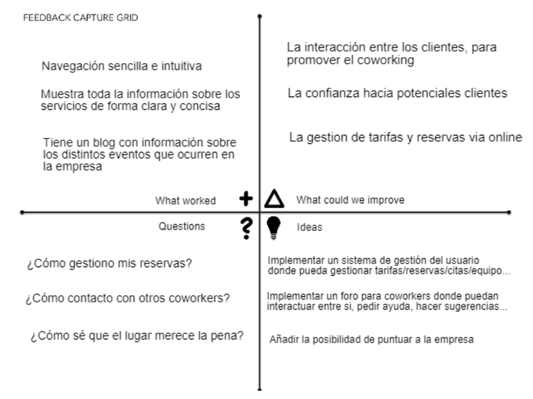
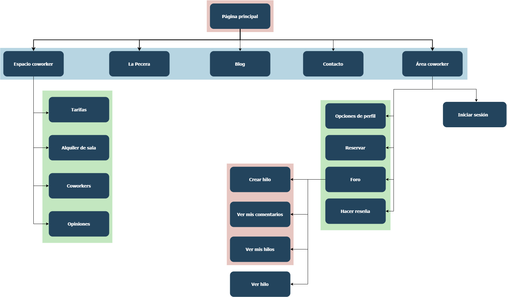

# UX-Case-Study-Coworking
## ¿Qué es ErranT?
ErranT es la página web de una empresa de coworking de Granada. La página web sirve como punto de información sobre los servicios que ofrece la empresa, entre los que se incluye espacios de coworking, salas de reuniones y un servicio de creación de contenido audiovisual para empresas. En ella se pueden consultar las distintas tarifas y las prestaciones de cada servicio. La página web no ofrece ninguna otra funcionalidad a parte de la de mostrar información sobre los servicios de la empresa.
## Análisis de ErranT
### Análisis Competitivo
El objetivo del análisis competitivo es encontrar similitudes entre los distintos servicios de coworking de Granada para obtener una idea precisa de qué uso dan las empresas de coworking a su página web. Para ello, hemos escogido cinco empresas de coworking situadas en la misma ciudad que ErranT. Los puntos a comprobar se dividen en cuatro bloques:
* ¿Cómo se muestran los servicios que ofertan?
* ¿Cómo se contacta con la empresa?
* ¿Qué información ofrece la empresa sobre sus clientes?
* ¿Qué tipo de gestión online ofrece la empresa?

A partir de los resultados de la tabla podemos observar que, respecto a los servicios que ofrecen, todas las páginas comparten una estructura similar. Todas tienen un apartado para cada servicio que ofrecen y suelen mostrar las distintas tarifas y prestaciones de cada servicio. Por otro lado, solo ErranT y Anda CoWork tienen una sección para presentar a las personas y empresas que trabajan con ellos, esto destaca pues el coworking se basa en trabajar en espacios multidisciplinales para enriquecer la experiencia de todos los usuarios, tiene sentido que la empresa que oferta dicho espacio quiera mostrar a qué se dedican sus usuarios. Por último, ninguna empresa tiene gestión online de ningún tipo, al menos no desde su página web.

En conclusión, todas las empresas analizadas utilizan su página web como un portal donde obtener información sobre sus servicios. En todas ellas se hace hincapié en contactar o bien en persona o a través del formulario. Ninguna ofrece una gestión online de tarifas, reserva de espacios o bienes comunes, etc.

### Personas y Journey Map
Una vez hemos realizado el análisis competitivo, vamos a analizar ahora cómo es la experiencia de usuario de ErranT en su estado actual. Para ello, vamos a crear dos personas que pueden ser usuarios potenciales de nuestra página web y vamos a desarollar el journey map de cada una para conocer cómo ha sido su paso por la página web. Por las restricciones de tiempo, vamos a utilizar las dos personas que creamos en la práctica 1, Armando y Vanessa:

Los journey maps obtenidos a partir de estas personas son los siguientes:

En el caso de Armando (el primer journey map), ha salido satisfecho de su visita a la página web ya que la información es clara y de acceso fácil. Por otro lado, en el caso de Vanessa, ella buscaba un espacio de coworking que ofreciera un servicio de gestión del cliente vía online, para así no tener que contactar con la empresa cada vez que quisiera cambiar una tarifa o reservar una sala.

### Feedback Capture Grid
El último elemento de anális que vamos a utilizar es el Feedback Capture Grid. Este elemento sirve para agrupar de forma estructurada y organizada la información obtenida en la etapas anteriores. A partir de él, podemos deducir qué mejoras aplicar a la página web.

## (Re)Diseño de ErranT
En el rediseño de ErranT, vamos a usar la información obtenida a partir del análisis anterior para determinar qué modificar o añadir para obtener una mejor experiencia de usuario. Tras hacer un brainstorming sobre las distintas posibilidades, hemos determinado que vamos a implementar un sistema de gestión de usuario.

Una vez el cliente haya contratado un servicio, será dado de alta en la plataforma online. A esta plataforma podrá acceder desde la página web, a partir de un usuario y contraseña. El usuario podra:
* Gestionar el tipo de tarifa que tiene, observar un historial de compra, modificar la tarifa, etc.
* Reservar las distintas salas y elementos que disponga la empresa, como sala de reuniones, taquillas personales, espacios de trabajo, etc.
* Publicar una reseña de erranT, que se mostrará en el apartado "Opiniones" de la página web, visible para cualquier visitante.
* Visitar el foro de coworkers, donde podrá publicar posts, comentar, colaborar con otros coworkers...

### Sitemap
La estructura nueva de la página web mantendrá todos los elementos de la original, añadiendo páginas para la nueva funcionalidad. Todos los elementos en la caja azul son accesibles a partir del menú de navegación de la página web. Para acceder al "área coworker", se realizará desde un botón en dicho menú.

### Labelling
Para dar claridad al sitemap y evitar ambigüedades entre los distintos sitios, en el documento de labelling se especifica el uso de cada sitio. El labelling se encuentra en el siguiente [documento](labelling.pdf).

### Wireframes
Una vez especificada la funcionalidad y la nueva estructura de la página, hay que hacer bocetos muy simples y esquemáticos sobre las distintas páginas. Como no vamos a modificar ninguna de las páginas ya existentes, solo se han realizado bocetos de los sitios nuevos, así como de la barra de navegación, que ha sido ligeramente modificada.

Los wireframes se pueden ver en la carpeta [Wireframes](wireframes/).